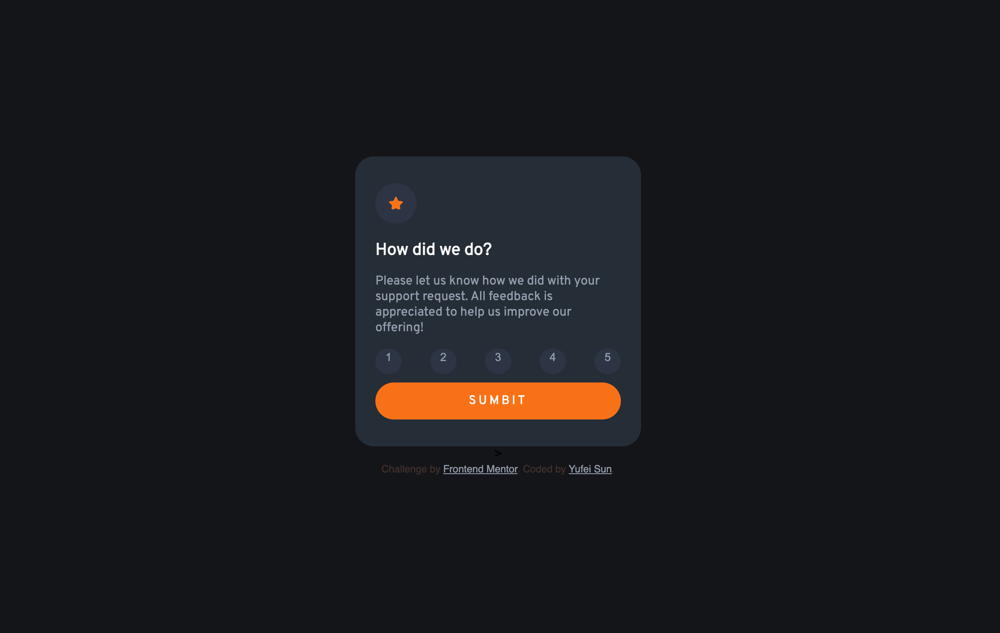

# Frontend Mentor - Interactive rating component solution

This is a solution to the [Interactive rating component challenge on Frontend Mentor](https://www.frontendmentor.io/challenges/interactive-rating-component-koxpeBUmI).
Check it live here! 👉 [My solution](https://siwi0w0.github.io/interactive-rating-component-main/)

## Table of contents

- [Overview](#overview)
  - [The challenge](#the-challenge)
  - [Screenshot](#screenshot)
  - [Links](#links)
- [My process](#my-process)
  - [Built with](#built-with)
  - [What I learned](#what-i-learned)
  - [Continued development](#Continued-development)
- [Author](#author)
- [Acknowledgments](#acknowledgments)

## Overview

### The challenge

Users should be able to:

- View the optimal layout for the app depending on their device's screen size
- See hover states for all interactive elements on the page
- Select and submit a number rating
- See the "Thank you" card state after submitting a rating

### Screenshot

### Links

- Solution URL: [My Solution](https://github.com/Siwi0w0/interactive-rating-component-main)

## My process

### Built with

- Semantic HTML5 markup
- CSS custom properties
- Flexbox
- CSS Grid
- Mobile-first workflow

### What I learned

How to use JavaScript to add some basic interactivity for my website. Use "hide"class and JavaScript to switch between pages.

### Continued development

I need to get myself more comfortable with CSS Grid, for I don't feel fully satisfied with the lay out. I'm also going to practice more with JavaScript and learn more about complex interactivity.

## Author

- Website - [YufeiSun](https://github.com/Siwi0w0)
- Frontend Mentor - [@Siwi0w0](https://www.frontendmentor.io/profile/Siwi0w0)

## Acknowledgments

Thanks for everyone who share their code in public so I can watch and learn from you! Also I'm happy that I have kept going and got this little challenge done. :)
